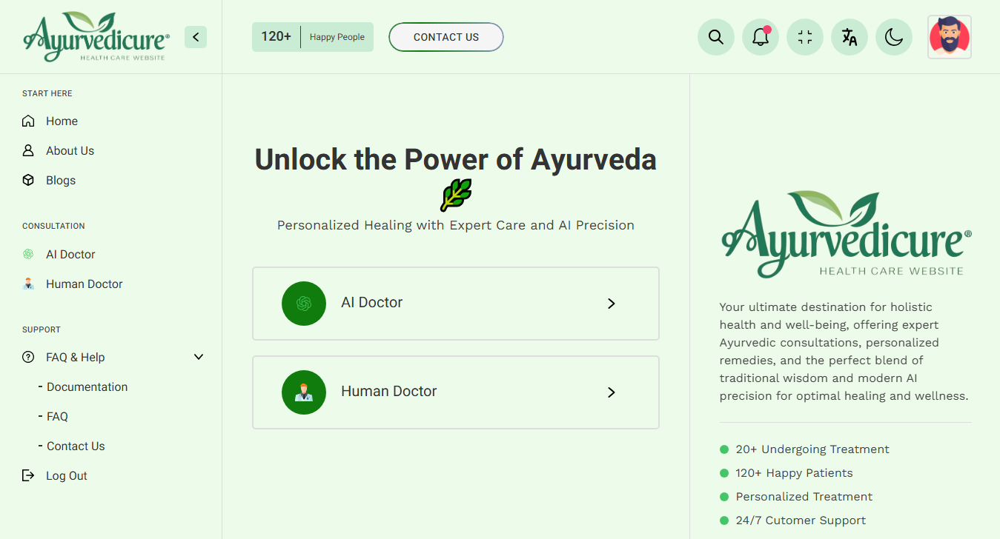

# AyurvediCure 🌿🧑‍⚕️🤖

Welcome to **AyurvediCure**, your personalized AI-ML based Ayurvedic doctor. Our platform offers a seamless and secure experience to help you manage your health with the wisdom of Ayurveda, using the latest advancements in artificial intelligence and machine learning.

## Project Overview 🌟

AyurvediCure provides users with two options for consultations:

1. **Talk to AI Doctor 🤖**: Get instant advice and recommendations from our AI-powered Ayurvedic doctor.
2. **Talk to Human Doctor 🧑‍⚕️**: Connect with a real Ayurvedic doctor for personalized consultations.

### Features 🌿

- **Personalized and Private Conversations**: All your interactions are secure and tailored to your needs.
- **Flexibility**: Switch seamlessly between AI and human doctors during your consultation.
- **Medical Records Safety**: Your medical records are stored securely and can be accessed anytime.
- **Locate Nearby Ayurvedic Doctors**: Find and connect with Ayurvedic doctors near you.

## Getting Started 🚀

To start using AyurvediCure, follow these steps:

1. **Register**: Sign up on our platform to create your account.
2. **Dashboard**: Once registered, access your personalized dashboard.
3. **Choose Your Doctor**: Select between talking to our AI doctor or a human doctor.
4. **Switch Flexibly**: Switch between AI and human doctors as needed during your consultation.
5. **Locate Doctors**: Use our tool to find nearby Ayurvedic doctors.

## Project Link 🔗

Explore the project here: [AyurvediCure](https://pkprajapati7402.github.io/AyurvediCure/)

## Repository Stats 📊

- **Repository Size**: 3 KB
- **Commits**: 150+
- **Contributors**: 5+
- **Issues**: 2 open, 7 closed
- **Pull Requests**: 2 open, 39 merged

## Contributing 🤝

We welcome contributions! Please read our [CONTRIBUTING.md](CONTRIBUTING.md) for guidelines on how to get started.

## License 📜

This project is licensed under the MIT License. See the [LICENSE](LICENSE) file for details.

## Contact 📧

For any inquiries or support, please contact us at krypto.etox@gmail.com.

---

Thank you for choosing AyurvediCure for your Ayurvedic health needs! 🌿✨
